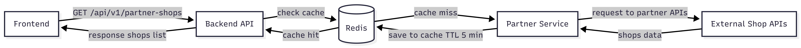

# Архитектура решения

## Общая идея

Сервис предназначен для получения списка партнёрских магазинов с информацией о доставке.
Данные агрегируются из внешних источников и оптимизируются с помощью кэширования.

---

## 📊 Схема архитектуры



---

## Поток данных (API Flow)

1. Пользователь открывает экран магазинов

2. Frontend отправляет запрос:

   ```
   GET /api/v1/partner-shops
   ```

3. Backend API:

   * проверяет наличие данных в кэше (Redis)

4. Возможны два сценария:

### Cache hit

* данные найдены в Redis
* Backend сразу возвращает ответ клиенту

### Cache miss

* данных в кэше нет
* Backend обращается в Partner Service

5. Partner Service:

   * запрашивает данные из внешних API магазинов
   * агрегирует и нормализует их

6. Полученные данные:

   * сохраняются в Redis (TTL ~5 минут)
   * возвращаются в Backend

7. Backend отправляет ответ клиенту

---

## Компоненты системы

### 1. Frontend

Отвечает за:

* отображение списка магазинов
* отправку запросов к API

---

### 2. Backend API

Отвечает за:

* обработку входящих запросов
* работу с кэшем
* маршрутизацию запросов
* возврат ответа клиенту

---

### 3. Redis (Cache)

Используется для:

* ускорения ответа
* снижения нагрузки на внешние API

Хранит:

* список магазинов
* TTL: ~5 минут

---

### 4. Partner Service

Отвечает за:

* интеграцию с внешними API
* агрегацию данных
* приведение данных к единому формату

---

### 5. External Shop APIs

Внешние системы партнёров, предоставляющие:

* список магазинов
* информацию о доставке

---

## Обработка ошибок

* при недоступности одного из партнёров:

  * возвращается частичный список
* ошибки логируются
* пользователь получает доступные данные без падения сервиса

---

## Масштабирование и улучшения

* добавление балансировки Backend API
* увеличение TTL при высокой нагрузке
* внедрение fallback-кэша
* добавление флага доступности магазина

---

## Принятые решения

* использование кэша (Redis) для повышения производительности
* разделение логики (Backend API / Partner Service)
* агрегация данных на стороне сервера

Это позволяет:

* уменьшить задержки
* повысить стабильность системы
* упростить работу клиента
